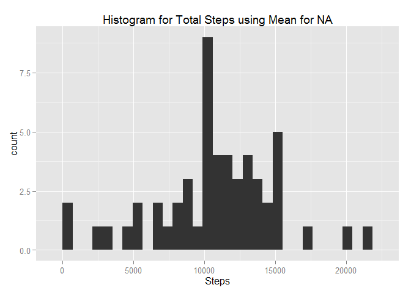
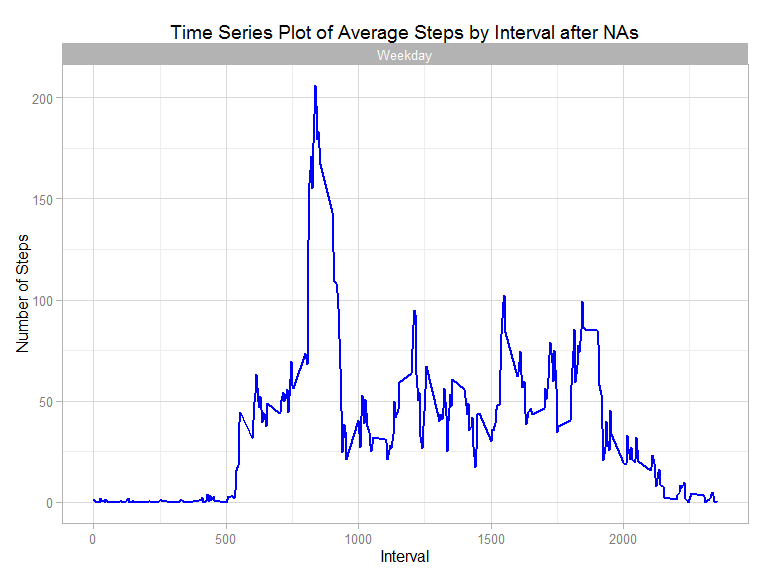

# Reproducible Research: Peer Assessment 1
Enrique Reveron  


## Loading and preprocessing the data

First load the data (read.csv())


```r
dt <- read.csv("activity.csv")
```

Those are the dataset (dt) column names and one example of the values 

```r
colnames(dt)
```

```
## [1] "steps"    "date"     "interval"
```

```r
dt[1,]
```

```
##   steps       date interval
## 1    NA 2012-10-01        0
```

## What is mean total number of steps taken per day?

According with the instructions, we will ignore the missing
values in the dataset.

1. Calculate the total number of steps taken per day

We will calculate the total steps per day in a new dataset using the function
aggregate()


```r
dt_total <- aggregate(steps ~ date, dt, sum)
```

Those are the columns of the new dataset (dt_total) and
one of the values:


```r
colnames(dt_total)
```

```
## [1] "date"  "steps"
```

```r
dt_total[1,]
```

```
##         date steps
## 1 2012-10-02   126
```


2. Make a histogram of the total number of steps taken each day


```r
library(ggplot2)
plot1 <- ggplot(dt_total,aes(x = steps)) +
            ggtitle("Histogram of daily steps") +
            xlab("steps") +
            geom_histogram()
plot1
```

```
## stat_bin: binwidth defaulted to range/30. Use 'binwidth = x' to adjust this.
```

 

3. Calculate and report the mean and median of the total number
of steps taken per day


```r
mean(dt_total$steps, na.rm = TRUE)
```

```
## [1] 10766.19
```

```r
median(dt_total$steps, na.rm = TRUE)
```

```
## [1] 10765
```


Those values must match with the ones that the function summary() provides:


```r
summary(dt_total)
```

```
##          date        steps      
##  2012-10-02: 1   Min.   :   41  
##  2012-10-03: 1   1st Qu.: 8841  
##  2012-10-04: 1   Median :10765  
##  2012-10-05: 1   Mean   :10766  
##  2012-10-06: 1   3rd Qu.:13294  
##  2012-10-07: 1   Max.   :21194  
##  (Other)   :47
```


Variable | Value
-------- | -----
Mean     | 1.0766189\times 10^{4}
Median   | 10765  

## What is the average daily activity pattern?

1. Make a time series plot (i.e. type = "l") of the 5-minute interval (x-axis) and the average number of steps taken, averaged across all days (y-axis)

Let aggregate the steps of all days per intervals, and calculate the average (mean)


```r
dt3 <- aggregate(steps ~ interval, dt, mean)
```

Those are the column names and one value of the new dataset


```r
colnames(dt3)
```

```
## [1] "interval" "steps"
```

```r
dt3[1,]
```

```
##   interval    steps
## 1        0 1.716981
```

```r
summary(dt3)
```

```
##     interval          steps        
##  Min.   :   0.0   Min.   :  0.000  
##  1st Qu.: 588.8   1st Qu.:  2.486  
##  Median :1177.5   Median : 34.113  
##  Mean   :1177.5   Mean   : 37.383  
##  3rd Qu.:1766.2   3rd Qu.: 52.835  
##  Max.   :2355.0   Max.   :206.170
```

This is the time series plot (type="l")


```r
plot2 <- ggplot(dt3,aes(interval,steps)) +
                 ggtitle("Time Series Plot of Average Steps by Interval") +
                 geom_line()
plot2  
```

 

Is possible to see in the plot that the biggest average of steps is between
500 and 1000 interval (5:00am to 10:00am) and the value is:


```r
max(dt3$steps)
```

```
## [1] 206.1698
```

2. Which 5-minute interval, on average across all the days in the dataset, contains the maximum number of steps?

And now to answer the question, let see the time interval for this maximun
average value:


```r
max_interval <- dt3[dt3$steps== max(dt3$steps),]
max_interval
```

```
##     interval    steps
## 104      835 206.1698
```

The time interval is 835

## Imputing missing values

1. Calculate and report the total number of missing values in the dataset (i.e. the total number of rows with NAs)


```r
sum(is.na(dt$steps))
```

```
## [1] 2304
```

2. Devise a strategy for filling in all of the missing values in the dataset. The strategy does not need to be sophisticated. For example, you could use the mean/median for that day, or the mean for that 5-minute interval, etc.

Let's use the mean of  every day to fill out the missing value, lets calculate
those values


```r
dt_non_na <- aggregate(steps ~ date, dt, mean, na.rm = FALSE, na.action = NULL)
colnames(dt_non_na)
```

```
## [1] "date"  "steps"
```

```r
dt_non_na[1,]
```

```
##         date steps
## 1 2012-10-01    NA
```


3. Create a new dataset that is equal to the original dataset but with the missing data filled in.

Lets merge both dataset to create the new one and them substitute the NA values
in the data set for the calculated median


```r
dt5 <- merge(x = dt, y = dt_non_na, by = "date", all.x= TRUE)
dt5[is.na(dt5$steps.x),c("steps.x")] <- dt5[is.na(dt5$steps.x),c("steps.y")]
```

Remove the last column added.


```r
dt5 <- subset(dt5, select = date:interval)
colnames(dt5) <- c("date","steps","interval")
```


4. Make a histogram of the total number of steps taken each day and Calculate and report the mean and median total number of steps taken per day. Do these values differ from the estimates from the first part of the assignment? What is the impact of imputing missing data on the estimates of the total daily number of steps?

Lets calculate the new total number of steps using the new dataset


```r
dt_total2 <- aggregate(steps ~ date, dt5, sum)
```

Lets plot the data


```r
plot3 <- ggplot(dt_total2,aes(x = steps)) +
            ggtitle("Histogram for Total Steps using Mean for NA") +
                 xlab("Steps") +
                 geom_histogram()
plot3
```

```
## stat_bin: binwidth defaulted to range/30. Use 'binwidth = x' to adjust this.
```

 

Let's calculate the new mean and median


```r
mean(dt_total2$steps, na.rm = TRUE)
```

```
## [1] 10766.19
```

```r
median(dt_total2$steps, na.rm = TRUE)
```

```
## [1] 10765
```


Those values must match with the ones that the function summary() provides:


```r
summary(dt_total2)
```

```
##          date        steps      
##  2012-10-02: 1   Min.   :   41  
##  2012-10-03: 1   1st Qu.: 8841  
##  2012-10-04: 1   Median :10765  
##  2012-10-05: 1   Mean   :10766  
##  2012-10-06: 1   3rd Qu.:13294  
##  2012-10-07: 1   Max.   :21194  
##  (Other)   :47
```

Variable                   | Value 
-------------------------- | ---------------------------------
Mean (not changing NAs)    | 1.0766189\times 10^{4}        
Mean (changing NAs)        | 1.0766189\times 10^{4}
-------------------------- | ---------------------------------
Median (not changing NAs)  | 10765      
Median (changing NAs)      |  1.0765\times 10^{4}


## Are there differences in activity patterns between weekdays and weekends?

1. Create a new factor variable in the dataset with two levels - "weekday" and "weekend" indicating whether a given date is a weekday or weekend day.


```r
dt5$weekday <- as.factor(
                         ifelse(
                               weekdays(as.Date(dt5$date)) %in%      
                                                      c("Saturday","Sunday"),   
                               "Weekend", 
                               "Weekday"))
```

2. Make a panel plot containing a time series plot (i.e. type = "l") of the 5-minute interval (x-axis) and the average number of steps taken, averaged across all weekday days or weekend days (y-axis). See the README file in the GitHub repository to see an example of what this plot should look like using simulated data.


```r
dt6  <- aggregate(x = dt5$steps,by=list(dt5$interval,dt5$weekday), 
                  FUN = mean ,na.rm=TRUE)

names(dt6) <- c("interval","day","steps")


plot4 <- ggplot(dt6,aes(interval,steps),factor(day)) +
            ggtitle("Time Series Plot of Average Steps by Interval after NAs") +
                 facet_wrap(~ day ) +
                 ylab("Number of Steps") + xlab("Interval") +
                 theme_light() +
                 theme(legend.position = "top") +
                 geom_line(color = "blue", size = 1)

plot4
```

 

I don't know why this plot didn't appear good in knitr, when I make it in 
RStudio it works well.

I was trying to figure out why and looks like is something regarding data types
an the libraries in knitr
